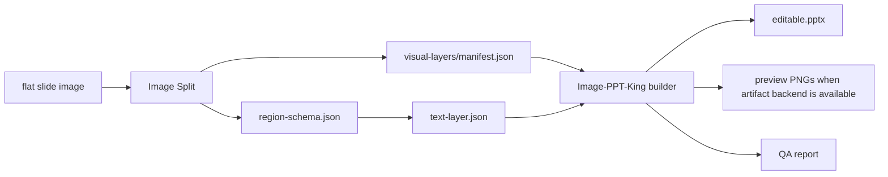

# Image-PPT-King

Turn flat slide images into editable PowerPoint decks.

Image-PPT-King is an open workflow for reconstructing image-based slides as layered, editable PPTX files. It combines Image Split visual assets, region schemas, transparent native text boxes, an optional rendering backend, and QA reports.

## What It Produces

- A `.pptx` deck with editable text boxes.
- Selectable visual objects for rebuilt shapes, icons, photos, charts, and diagrams.
- Rendered slide previews and layout JSON when the Codex Presentations artifact backend is available.
- Build manifests and visual/text QA reports.
- A build manifest that records route, slide size, asset count, and text-fill policy.

## What It Does Not Promise

Image-PPT-King is not a magic vectorizer. Complex charts, photos, microscopy images, logos, and dense illustrations may remain as selectable image objects. The core promise is that semantic slide text and regular UI geometry are separated from the flattened screenshot whenever the source quality allows it.

## Pipeline



## Reproducibility Profile

The bundled `npm run demo` path is deterministic and does not require an AI model. Production-quality reconstruction of real decks does require a capable agent runtime because the hard work is visual-layer judgment, text correction, layout anchoring, OCR conflict resolution, and QA review.

Recommended agent runtime:

- Codex-style agent mode with local file read/write and command execution.
- Multimodal model with image input and strong visual reasoning.
- Frontier reasoning model, such as GPT-5.5 or an equivalent model, for dense or high-value decks.
- Reasoning effort: `high` for normal production work; `xhigh` when available for difficult full-deck reconstruction.
- Long enough context to inspect source images, Image Split manifests, OCR evidence, `text-layer.json`, PPTX XML, previews, and QA reports together.

Known-good author setup: macOS, Codex-style local agent, GPT-5.5-class multimodal reasoning, and `xhigh` reasoning for difficult pages. Smaller or lower-reasoning models can still run the builder, but may need more human correction for text placement, style consistency, and QA decisions.

## Quick Start

Install Python QA dependencies:

```bash
python -m venv .venv
source .venv/bin/activate
pip install -r requirements.txt
```

Install the public PPTX fallback dependency:

```bash
npm install
```

Run the PPTX builder:

```bash
node skills/image-ppt-king/scripts/build_ppt_from_layers.mjs \
  --backend auto \
  --layers-root examples/demo/visual-layers \
  --text-json examples/demo/text-layer.json \
  --out outputs/demo/editable.pptx \
  --workspace outputs/demo/workspace \
  --preview-dir outputs/demo/preview \
  --layout-dir outputs/demo/layout \
  --slide-size 960x540
```

Builder note: `--backend auto` tries the Codex Presentations artifact runtime first. That runtime can export preview PNGs and layout JSON. If it is unavailable, the script falls back to the public `pptxgenjs` backend and still writes an editable PPTX plus a build manifest. To force a backend, use `--backend artifact` or `--backend pptxgenjs`.

If the artifact runtime cannot discover itself automatically, set:

```bash
export PRESENTATIONS_ARTIFACT_UTILS=/path/to/artifact_tool_utils.mjs
```

## Platform Notes

The repository is authored and validated primarily on macOS. The fallback builder is cross-platform Node.js and the QA script is cross-platform Python, but shell setup differs:

- macOS/Linux/WSL2: use the commands as written with `python -m venv`, `source .venv/bin/activate`, `npm install`, and POSIX line continuations.
- Windows PowerShell: use `py -m venv .venv`, then `.venv\Scripts\Activate.ps1`, then `pip install -r requirements.txt` and `npm install`.
- Use Node.js 18+ and Python 3.10+.
- For best parity with the author's workflow on Windows, use WSL2 when combining this project with Docker OCR or heavier Image Split pipelines.
- PowerPoint/WPS visual fidelity can differ by OS and font availability. For Chinese decks, install compatible fonts such as `PingFang SC` on macOS or `Microsoft YaHei` on Windows, then inspect representative slides manually.

## Required Inputs

- `visual-layers/`: page folders produced by Image Split.
- `manifest.json`: one per page folder, listing assets and placement metadata.
- `text-layer.json`: editable text objects, documented in `skills/image-ppt-king/references/text-layer-schema.md`.
- Optional OCR evidence from Image Split: `ocr-candidates.json`, `ocr-merged.json`, `ocr-review-report.md`.

## Skill

The reusable agent skill lives at:

```text
skills/image-ppt-king/SKILL.md
```

For Codex-style skill installation, copy `skills/image-ppt-king/` into your local skills directory and restart the agent.

The skill folder is also self-contained for a smoke test:

```bash
cd ~/.codex/skills/image-ppt-king
npm install
npm run demo
```

## Design Principle

The important boundary is:

```text
visual objects belong in Image Split
semantic text belongs in Image-PPT-King
QA decides whether the reconstruction is acceptable
```

## Status

This repository is a first open-source packaging pass over a working local workflow. The public fallback path can generate editable PPTX files with `pptxgenjs`; the Codex Presentations artifact backend remains the richer path for preview PNGs and layout JSON.
