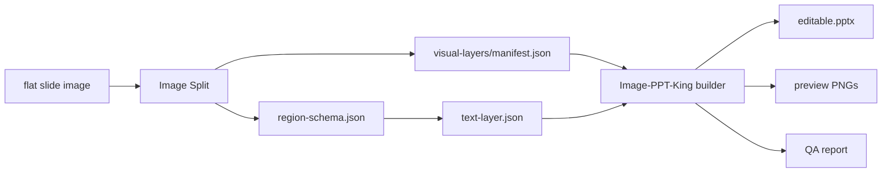

# Image-PPT-King

Turn flat slide images into editable PowerPoint decks.

Image-PPT-King is an open workflow for reconstructing image-based slides as layered, editable PPTX files. It combines Image Split visual assets, region schemas, transparent native text boxes, rendering previews, and QA reports.

## What It Produces

- A `.pptx` deck with editable text boxes.
- Selectable visual objects for rebuilt shapes, icons, photos, charts, and diagrams.
- Rendered slide previews.
- Layout JSON and visual/text QA reports.
- A build manifest that records route, slide size, asset count, and text-fill policy.

## What It Does Not Promise

Image-PPT-King is not a magic vectorizer. Complex charts, photos, microscopy images, logos, and dense illustrations may remain as selectable image objects. The core promise is that semantic slide text and regular UI geometry are separated from the flattened screenshot whenever the source quality allows it.

## Pipeline



## Quick Start

Install Python QA dependencies:

```bash
python -m venv .venv
source .venv/bin/activate
pip install -r requirements.txt
```

Run the PPTX builder:

```bash
node skills/image-ppt-king/scripts/build_ppt_from_layers.mjs \
  --layers-root examples/demo/visual-layers \
  --text-json examples/demo/text-layer.json \
  --out outputs/demo/editable.pptx \
  --workspace outputs/demo/workspace \
  --preview-dir outputs/demo/preview \
  --layout-dir outputs/demo/layout \
  --slide-size 960x540
```

Current builder note: the included `build_ppt_from_layers.mjs` adapter uses the Codex Presentations artifact runtime. If it cannot discover the runtime automatically, set:

```bash
export PRESENTATIONS_ARTIFACT_UTILS=/path/to/artifact_tool_utils.mjs
```

## Required Inputs

- `visual-layers/`: page folders produced by Image Split.
- `manifest.json`: one per page folder, listing assets and placement metadata.
- `text-layer.json`: editable text objects, documented in `skills/image-ppt-king/references/text-layer-schema.md`.
- Optional OCR evidence from Image Split: `ocr-candidates.json`, `ocr-merged.json`, `ocr-review-report.md`.

## Skill

The reusable agent skill lives at:

```text
skills/image-ppt-king/SKILL.md
```

For Codex-style skill installation, copy `skills/image-ppt-king/` into your local skills directory and restart the agent.

## Design Principle

The important boundary is:

```text
visual objects belong in Image Split
semantic text belongs in Image-PPT-King
QA decides whether the reconstruction is acceptable
```

## Status

This repository is a first open-source packaging pass over a working local workflow. Before a stable public release, the main remaining task is to add a standalone PPTX backend or document the Codex Presentations adapter as an explicit runtime dependency.
